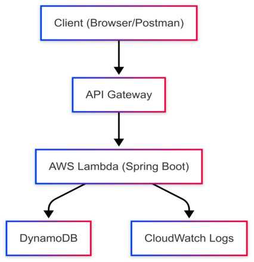

# 🧩 Task Manager API — Serverless Portfolio Project

This project is a cloud-native, serverless task management API built with **Spring Boot**, **AWS Lambda**, and **DynamoDB**, designed to demonstrate hands-on expertise in **Java**, **AWS architecture**, and **system design**. It serves as a portfolio artifact for showcasing backend engineering and solution architecture capabilities.

---

## 🚀 Objectives

- Build a modular, production-ready REST API using Spring Boot and AWS services
- Apply serverless principles with AWS Lambda and API Gateway
- Design scalable data models using DynamoDB with GSIs
- Implement CI/CD pipelines and local testing strategies
- Explore AWS concepts from a solution architect’s perspective

---

## 🏗️ Architecture Overview

| Layer         | Technology                     | Purpose                                      |
|--------------|----------------------------------|----------------------------------------------|
| Compute       | AWS Lambda + Spring Boot        | Stateless function execution                 |
| API Gateway   | REST API                        | HTTP routing to Lambda                       |
| Storage       | DynamoDB                        | NoSQL persistence with GSI for status query  |
| CI/CD         | GitHub Actions                  | Automated build, test, and deploy            |
| Local Testing | Testcontainers + LocalStack     | Simulated AWS environment for integration    |

---
## 🧭 Architecture Diagram

---
## 📦 Features Implemented

- ✅ Create, update, delete, and retrieve tasks
- ✅ Query tasks by status using DynamoDB GSI
- ✅ Integration tests using LocalStack and Testcontainers
- ✅ Controller tests with MockMvc
- ✅ Modular separation of controller, service, and repository layers
- ✅ Dynamic property injection for test environments
- ✅ Spring Boot Lambda handler for AWS deployment

---

## 🧪 Testing Strategy

- **Unit Tests**: Validate service and repository logic in isolation
- **Integration Tests**: Use LocalStack to simulate DynamoDB and test real interactions
- **Controller Tests**: Use MockMvc to verify REST endpoints and request handling

---

## ⚠️ Challenges Faced & Solutions

### 1. **DynamoDB Client Failing in CI**
- ❌ Error: `Unable to load region from any of the providers in the chain`
- ✅ Solution: Explicitly set region and endpoint using `@DynamicPropertySource` and inject via `DynamoProperties`

### 2. **Credential Resolution Failure**
- ❌ Error: `Unable to load credentials from any of the providers in the chain`
- ✅ Solution: Inject static credentials (`accessKey`, `secretKey`) via test profile and configure `AwsConfig` to use `StaticCredentialsProvider`

### 3. **Cold Start Performance in Lambda**
- ❌ Spring Boot startup time impacts Lambda responsiveness
- ✅ Solution: Investigated lighter frameworks (Micronaut, Quarkus) and optimized bean loading

### 4. **Test Isolation and Environment Separation**
- ❌ Mixing test and production config caused brittle tests
- ✅ Solution: Used `@TestPropertySource` and `LocalStackTestConfig` to isolate test environment

---

## 📚 AWS Concepts Explored

| Concept             | Applied In Project                          |
|---------------------|---------------------------------------------|
| Lambda              | Spring Boot handler for stateless compute   |
| API Gateway         | REST endpoint routing to Lambda             |
| DynamoDB            | Table design, GSI, conditional queries      |
| IAM                 | Execution roles and least privilege access  |
| CloudWatch Logs     | Structured logging and observability        |
| CI/CD               | GitHub Actions for build and test automation|
| LocalStack          | Simulated AWS services for integration tests|

---

## 🧠 Next Steps

- Add pagination and filtering to task queries
- Integrate Cognito or IAM for API security
- Deploy infrastructure using AWS SAM or Terraform
- Add DynamoDB Streams for event-driven workflows
- Implement structured logging with correlation IDs

---

## 👨‍💻 Author

**Kishore** — Backend Engineer & Solution Architect  
Currently Assistant Director IT in government, transitioning into a hands-on technical role in cloud-native software engineering.

---

## 📜 License

This project is open for educational and portfolio purposes. Feel free to fork and adapt.

## References

- [Spring Cloud Function AWS Adapter](https://docs.spring.io/spring-cloud-function/docs/current/reference/html/aws.html)
- [AWS Lambda Java Documentation](https://docs.aws.amazon.com/lambda/latest/dg/java-handler.html)
- [AWS DynamoDB Documentation](https://docs.aws.amazon.com/amazondynamodb/latest/developerguide/Introduction.html)
- [LocalStack Documentation](https://docs.localstack.cloud/)
