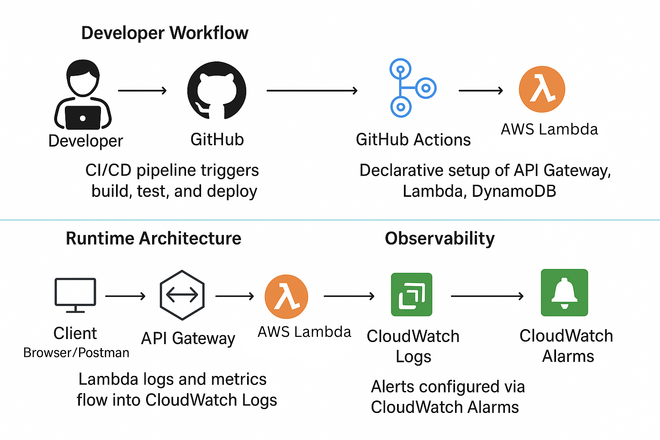

# 🧩 Task Manager API — Serverless Portfolio Project


This project is a cloud-native, serverless task management API built with **Spring Boot**, **AWS Lambda**, and **DynamoDB**, designed to demonstrate hands-on expertise in **Java**, **AWS architecture**, and **system design**. It serves as a portfolio artifact for showcasing backend engineering and solution architecture capabilities.


# 🚀 Objectives

- Build a modular, production-ready REST API using Spring Boot and AWS services
- Apply serverless principles with AWS Lambda and API Gateway
- Design scalable data models using DynamoDB with GSIs
- Implement CI/CD pipelines and local testing strategies
- Explore AWS concepts from a solution architect’s perspective  

  
# 🏗️ Architecture Overview

| Layer         | Technology                     | Purpose                                      |
|--------------|----------------------------------|----------------------------------------------|
| Compute       | AWS Lambda + Spring Boot        | Stateless function execution                 |
| API Gateway   | REST API                        | HTTP routing to Lambda                       |
| Storage       | DynamoDB                        | NoSQL persistence with GSI for status query  |
| CI/CD         | GitHub Actions                  | Automated build, test, and deploy            |
| Local Testing | Testcontainers + LocalStack     | Simulated AWS environment for integration    |

# 🧭 Architecture Diagram




# ✨ Features

✅ Create, update, delete, and retrieve tasks via REST API  
✅ Query tasks by status using DynamoDB GSI  
✅ Serverless deployment using AWS Lambda and API Gateway  
✅ Local testing with LocalStack and profile-based configuration  
✅ Integration tests using LocalStack and Testcontainers  
✅ CI/CD pipeline with GitHub Actions  
✅ Modular separation of controller, service, and repository layers  
✅ Dynamic property injection for test environments  
✅ Structured logging and centralized error handling  


# 🛠️ Tech Stack

- **Java 17** – Core language for backend development
- **Spring Boot** – Framework for building RESTful APIs
- **AWS Lambda** – Serverless compute for scalable execution
- **Amazon DynamoDB** – NoSQL database for task storage
- **API Gateway** – Entry point for REST endpoints
- **LocalStack** – Local AWS emulation for integration testing
- **GitHub Actions** – CI/CD pipeline automation
- **SAM CLI** – Infrastructure as code for Lambda deployment
- **SLF4J + MDC** – Structured logging and traceability
- **JUnit + Mockito** – Unit and integration testing framework

# 🧪 Testing Strategy

- **Unit Tests**: Validate service and repository logic in isolation
- **Integration Tests**: Use LocalStack to simulate DynamoDB and test real interactions
- **Controller Tests**: Use MockMvc to verify REST endpoints and request handling

# 📦 Usage Examples

...

📖 [View full API samples](docs/api-samples.md)

### Create a Task
```bash
curl -X POST https://your-api-url/tasks \
  -H "Content-Type: application/json" \
  -d '{
    "title": "Write documentation",
    "description": "Add usage examples to README",
    "status": "PENDING"
  }'
```

### Get All Tasks
```bash
curl -X GET https://your-api-url/tasks
```

### Get Tasks by Status
```bash
curl -X GET "https://your-api-url/tasks?status=IN_PROGRESS"
```

### Update a Task
```bash
curl -X PUT https://your-api-url/tasks/{taskId} \
  -H "Content-Type: application/json" \
  -d '{
    "title": "Write documentation",
    "description": "Add usage examples to README",
    "status": "COMPLETED"
  }'
  ```

 ### Delete a Task
  ```bash
  curl -X DELETE https://your-api-url/tasks/{taskId}
  ```

# 🚀 Deployment Guide

This guide explains how to deploy the Task Manager API using AWS SAM CLI.

📖 [Deployment Guide](docs/deployment-guide.md)


# 🛠️ Troubleshooting Snapshot

|   Issue Description                             | ❗ Error Message / Symptom                                      | ✅ Resolution Summary                                           |
|--------------------------------------------------|----------------------------------------------------------------|----------------------------------------------------------------|
| ⚙️ DynamoDB client failed in CI                  | `Unable to load region from any of the providers in the chain` | Injected region via `@DynamicPropertySource` and config class |
| 🔐 Credential resolution failure                 | `Unable to load credentials from any of the providers in the chain` | Used static credentials in test profile and `AwsConfig`     |
| 🕒 Cold start latency in Lambda                  | High startup time during first invocation                      | Scoped bean loading, explored lighter frameworks              |
| 🧪 Test config leaking into production           | Brittle tests, unexpected behavior                             | Isolated profiles using `@TestPropertySource` and config class|
| 📉 GSI missing for status query                  | Full table scans, poor performance                             | Added `status-index` GSI and refactored query logic           |
| 🌩️ Local vs cloud behavior drift                | Tests pass locally, fail in AWS                                | Added cloud-specific test cases and documented limitations    |
| 🧩 Lambda handler misconfigured                  | Lambda invocation failed                                       | Used `FunctionInvoker::handleRequest` from Spring adapter     |
| 🔄 CI/CD pipeline instability                    | GitHub Actions failed intermittently                           | Added Docker service config and readiness checks              |
| 🧭 Environment config hardcoded                  | Config values leaked across environments                       | Used `@ConfigurationProperties` and profile-based injection   |
| 📋 Unstructured logs                             | Difficult to trace issues                                      | Integrated SLF4J + MDC for structured logging                 |
| 🚫 Inconsistent error responses                  | Default Spring error pages leaked into API                     | Centralized error handling with `@ControllerAdvice`           |
| 🔄 DTO and entity coupling                       | Internal models exposed via API                                | Introduced DTOs and mappers for clean separation              |
| ⏱️ Lambda timeout/memory exceeded                | Function crashed under load                                    | Increased limits and optimized queries                        |
| 📚 Documentation lagging behind                  | Features undocumented or outdated                              | Created `docs/`, added diagrams, changelogs, and badges       |


# ⚠️ Challenges Faced & Solutions

This section documents real-world challenges encountered while building and deploying the Task Manager API, along with the solutions and architectural insights that shaped the final system.

### 1. Credential Resolution Failure in Local and CI Environments  
❗ **Problem**: AWS SDK failed to initialize `DynamoDbClient` due to missing credentials.  
✅ **Fix**: Injected static credentials via test profile and configured `AwsConfig` to use `StaticCredentialsProvider` conditionally.  
💡 **Insight**: Avoid relying on implicit credential chains. Explicit configuration improves portability and test reliability.

### 2. Region and Endpoint Configuration for LocalStack  
❗ **Problem**: Integration tests failed due to missing or incorrect AWS region and endpoint.  
✅ **Fix**: Used `@DynamicPropertySource` to inject LocalStack endpoint and region dynamically.  
💡 **Insight**: Dynamic property injection ensures environment-specific configurations are isolated and testable.

### 3. Cold Start Performance in AWS Lambda  
❗ **Problem**: Spring Boot’s startup time impacted Lambda responsiveness.  
✅ **Fix**: Scoped bean loading, minimized dependencies, and explored lighter frameworks like Micronaut and Quarkus.  
💡 **Insight**: Cold start latency affects UX and cost — optimize startup paths in serverless design.

### 4. Test Isolation and Environment Separation  
❗ **Problem**: Mixing production and test configurations led to brittle tests.  
✅ **Fix**: Created test-specific profiles and isolated AWS config using `LocalStackTestConfig`.  
💡 **Insight**: Environment isolation is foundational for reliable testing and safe CI/CD pipelines.

### 5. DynamoDB GSI Query Design  
❗ **Problem**: Querying tasks by status triggered full table scans.  
✅ **Fix**: Added a GSI (`status-index`) and refactored queries to use `QueryRequest`.  
💡 **Insight**: Indexing strategy in NoSQL systems directly impacts performance and cost.

### 6. Local Testing vs Cloud Behavior Drift  
❗ **Problem**: Tests passed locally but failed in AWS due to emulation gaps.  
✅ **Fix**: Added environment-specific test cases and documented LocalStack limitations.  
💡 **Insight**: Validate critical paths in real cloud environments — emulation is powerful but imperfect.

### 7. Spring Boot Lambda Handler Configuration  
❗ **Problem**: Lambda failed to invoke Spring Boot due to misconfigured handler.  
✅ **Fix**: Used `FunctionInvoker::handleRequest` and verified wiring with minimal payloads.  
💡 **Insight**: Framework integration with Lambda requires precise handler setup and lightweight bootstrapping.

### 8. CI/CD Pipeline Stability  
❗ **Problem**: GitHub Actions intermittently failed due to Docker dependencies and timing issues.  
✅ **Fix**: Added Docker service config, readiness checks, and isolated test profiles.  
💡 **Insight**: CI/CD pipelines must be resilient to environment drift and dependency timing.

### 9. Handling Environment-Specific Configuration Without Hardcoding  
❗ **Problem**: Config values leaked across environments, causing unpredictable behavior.  
✅ **Fix**: Used `@ConfigurationProperties` and profile-specific bindings to isolate configs.  
💡 **Insight**: Clean separation of environment configs is essential for portability and security.

### 10. Structured Logging for Observability  
❗ **Problem**: Logs lacked context, making debugging difficult.  
✅ **Fix**: Integrated SLF4J with MDC for structured, contextual logging.  
💡 **Insight**: Observability isn’t just about logs — it’s about traceability and actionable insights.

### 11. Error Handling and Response Consistency  
❗ **Problem**: API responses were inconsistent across failure scenarios.  
✅ **Fix**: Centralized error handling with `@ControllerAdvice` and standardized error DTOs.  
💡 **Insight**: Consistent error handling improves client trust and system resilience.

### 12. DTO vs Entity Separation  
❗ **Problem**: Internal entity models were exposed directly through the API.  
✅ **Fix**: Introduced DTOs and mappers to decouple persistence from API contracts.  
💡 **Insight**: DTO separation is key for API evolution, security, and clean layering.

### 13. Lambda Timeout and Memory Constraints  
❗ **Problem**: Complex operations exceeded Lambda’s default limits.  
✅ **Fix**: Increased timeout/memory in SAM template and optimized queries.  
💡 **Insight**: Serverless design requires tight control over resource usage — efficiency is a cost factor.

### 14. Documentation Drift and Technical Debt  
❗ **Problem**: Evolving features outpaced documentation updates.  
✅ **Fix**: Created a `docs/` folder, added diagrams, changelogs, and badges.  
💡 **Insight**: Documentation is part of the system — version it, test it, and treat it as essential.


# 📚 AWS Concepts Explored

| Concept             | Applied In Project                          |
|---------------------|---------------------------------------------|
| Lambda              | Spring Boot handler for stateless compute   |
| API Gateway         | REST endpoint routing to Lambda             |
| DynamoDB            | Table design, GSI, conditional queries      |
| IAM                 | Execution roles and least privilege access  |
| CloudWatch Logs     | Structured logging and observability        |
| CI/CD               | GitHub Actions for build and test automation|
| LocalStack          | Simulated AWS services for integration tests|


# 🧠 Next Steps

- Add pagination and filtering to task queries
- Integrate Cognito or IAM for API security
- Deploy infrastructure using AWS SAM or Terraform
- Add DynamoDB Streams for event-driven workflows
- Implement structured logging with correlation IDs


# 👨‍💻 Author

[Kishore Rajkumar](https://github.com/kishore-rajkumar) — Backend Engineer & Solution Architect  
Currently Assistant Director IT in government, transitioning into a hands-on technical role in cloud-native software engineering.


# 📜 License

This project is open for educational and portfolio purposes. Feel free to fork and adapt.

# References

- [Spring Cloud Function AWS Adapter](https://docs.spring.io/spring-cloud-function/docs/current/reference/html/aws.html)
- [AWS Lambda Java Documentation](https://docs.aws.amazon.com/lambda/latest/dg/java-handler.html)
- [AWS DynamoDB Documentation](https://docs.aws.amazon.com/amazondynamodb/latest/developerguide/Introduction.html)
- [LocalStack Documentation](https://docs.localstack.cloud/)
